# Ruta de recomendaciones desde ingreso hasta alta

Esta vista reorganiza la sintesis de recomendaciones como un proceso asistencial. Mezcla las 19 guias y conserva, para cada paso, el consenso global y el apoyo observado en guias con AGREE-II preliminar `>60%`.

```mermaid
flowchart LR
    P01["Ingreso y contencion inicial"] --> P02["Evaluacion diagnostica"]
    P02 --> P03["Inicio antipsicotico"]
    P03 --> P04["Monitoreo y adherencia"]
    P04 --> P05["Psicosocial temprano"]
    P05 --> P06["Comorbilidades"]
    P06 --> P07["No respuesta/TRS"]
    P07 --> P08["Rehabilitacion"]
    P08 --> P09["Alta y continuidad"]
```

## Lectura rapida

- La ruta no reemplaza juicio clinico; ordena temas de guias como proceso.
- `Consenso global` usa las 19 guias.
- `Apoyo en guias >60%` muestra si APA 2020 y/o VA/DoD 2024 sostienen el paso.
- Las filas marcadas como `mixed/discordant` deben redactarse como condicionales o dependientes del contexto.

## P01. Ingreso y contencion inicial

**Momento clinico:** Primer contacto, emergencia, hospitalizacion o derivacion urgente

**Objetivo:** Confirmar seguridad inmediata, definir urgencia, activar contencion proporcional y evitar intervenciones innecesarias.

| Recomendacion | Que hacer | Consenso global | Apoyo en guias >60% | Senal |
| --- | --- | --- | --- | --- |
| Risk assessment: suicide, aggression and immediate safety | Evaluar suicidio, autoagresion, agresion, violencia y seguridad inmediata en la valoracion; activar rutas de crisis o guias de autolesion cuando haya riesgo. | Escaso: 4/19 guias (21%); alineado/escaso; dominante: recomienda (2); recomienda=2; evalua/monitoriza=2 | Moderado: 1/2 guias (50%); alineado/escaso; 1/2: APA 2020 | mostly aligned or sparse |
| Acute agitation, rapid tranquillisation and crisis setting | Priorizar evaluacion rapida, desescalada y equipos de crisis; usar tratamiento comunitario/crisis cuando sea posible y tranquilizacion rapida o formulaciones parenterales si la via oral no es viable o hay riesgo inmediato. | Escaso: 4/19 guias (21%); discordante; dominante: recomienda (7); recomienda=7; ofrece=3; considera/sugiere=5; en contra/no hacer=1 | Ausente: 0/2 guias (0%); discordante; sin recomendaciones; 0/2: ninguna | mixed/discordant |
| At-risk mental state and prevention of psychosis | Usar evaluacion especializada y herramientas de tamizaje para riesgo de transicion; ofrecer apoyo psicologico/familiar y seguimiento temprano; no usar antipsicoticos de rutina solo por estado de alto riesgo. | Escaso: 3/19 guias (16%); discordante; dominante: considera/sugiere (2); recomienda=1; considera/sugiere=2; en contra/no hacer=1 | Moderado: 1/2 guias (50%); discordante; 1/2: VA/DoD 2024 | mixed/discordant |
## P02. Evaluacion diagnostica y formulacion inicial

**Momento clinico:** Primeras horas/dias tras ingreso o evaluacion especializada

**Objetivo:** Construir diagnostico diferencial, plan de cuidados, baseline clinico y contexto individual.

| Recomendacion | Que hacer | Consenso global | Apoyo en guias >60% | Senal |
| --- | --- | --- | --- | --- |
| Diagnostic assessment, baseline workup and care planning | Realizar evaluacion psiquiatrica especializada, examen mental, diagnostico diferencial, riesgo, plan de cuidados, historia de tratamientos y estudios basales fisicos/laboratoriales o neurologicos cuando esten indicados. | Bajo: 7/19 guias (37%); discordante; dominante: evalua/monitoriza (13); recomienda=6; ofrece=1; considera/sugiere=4; en contra/no hacer=1; evalua/monitoriza=13 | Alto: 2/2 guias (100%); discordante; 2/2: APA 2020; VA/DoD 2024 | mixed/discordant |
| First episode psychosis and early intervention | Evaluar rapidamente el primer episodio, derivar a servicios de intervencion temprana, ofrecer antipsicotico oral mas intervenciones psicosociales/familiares y realizar estudio clinico-basico segun indicacion. | Moderado: 10/19 guias (53%); alineado/escaso; dominante: recomienda (11); recomienda=11; ofrece=2; considera/sugiere=6; evalua/monitoriza=2 | Moderado: 1/2 guias (50%); alineado/escaso; 1/2: VA/DoD 2024 | broad recurrent theme |
| Culture, equity, age and other special populations | Adaptar la atencion a contexto cultural, edad y equidad; buscar supervision transcultural cuando sea necesario; usar antipsicoticos en adolescentes u otros grupos especiales bajo supervision especializada. | Escaso: 4/19 guias (21%); alineado/escaso; dominante: recomienda (6); recomienda=6; considera/sugiere=1; evalua/monitoriza=1 | Ausente: 0/2 guias (0%); alineado/escaso; sin recomendaciones; 0/2: ninguna | mostly aligned or sparse |
| Shared decision-making and patient preferences | Tomar decisiones con la persona y, si consiente, cuidadores; discutir beneficios, efectos adversos y preferencias; acordar planes de medicacion, transicion y objetivos de tratamiento. | Escaso: 4/19 guias (21%); alineado/escaso; dominante: recomienda (3); recomienda=3; ofrece=1; considera/sugiere=2; evalua/monitoriza=1 | Moderado: 1/2 guias (50%); alineado/escaso; 1/2: VA/DoD 2024 | mostly aligned or sparse |
## P03. Inicio del tratamiento antipsicotico

**Momento clinico:** Fase aguda temprana, una vez definidos seguridad, diagnostico probable y preferencias

**Objetivo:** Elegir, iniciar y titular antipsicotico de forma individualizada y documentada.

| Recomendacion | Que hacer | Consenso global | Apoyo en guias >60% | Senal |
| --- | --- | --- | --- | --- |
| Acute antipsychotic initiation | Iniciar antipsicotico oral en psicosis aguda o primer episodio con participacion especializada; no iniciarlo en atencion primaria sin consulta psiquiatrica; combinar con intervenciones psicosociales cuando corresponda. | Escaso: 2/19 guias (11%); discordante; dominante: recomienda (2); recomienda=2; ofrece=2; considera/sugiere=1; en contra/no hacer=1 | Ausente: 0/2 guias (0%); discordante; sin recomendaciones; 0/2: ninguna | mixed/discordant |
| Antipsychotic choice and comparative selection | Seleccionar el antipsicotico mediante decision compartida, considerando respuesta previa, efectos adversos, preferencias, comorbilidades, interacciones, embarazo/reproduccion y necesidad de cambio por no respuesta o intolerancia. | Bajo: 8/19 guias (42%); discordante; dominante: recomienda (12); recomienda=12; ofrece=2; considera/sugiere=3; en contra/no hacer=1; evalua/monitoriza=1 | Moderado: 1/2 guias (50%); discordante; 1/2: VA/DoD 2024 | mixed/discordant |
| Dose, titration and adequate trial duration | Tratar cada antipsicotico como ensayo terapeutico explicito: iniciar y titular segun tolerancia, usar dosis y duracion adecuadas, revisar PRN y evitar escalamiento rapido o dosis altas sin justificacion. | Moderado: 11/19 guias (58%); discordante; dominante: considera/sugiere (13); recomienda=5; ofrece=2; considera/sugiere=13; en contra/no hacer=4; evalua/monitoriza=4 | Alto: 2/2 guias (100%); discordante; 2/2: APA 2020; VA/DoD 2024 | mixed/discordant |
| Antipsychotic adverse-effect management | Elegir, ajustar o cambiar antipsicotico segun efectos adversos y tolerabilidad; monitorizar y tratar EPS, acatisia, discinesia tardia, prolactina, sedacion, estrenimiento, QTc y riesgos renales/cardiometabolicos. | Bajo: 7/19 guias (37%); discordante; dominante: recomienda (11); recomienda=11; considera/sugiere=7; en contra/no hacer=1 | Alto: 2/2 guias (100%); discordante; 2/2: APA 2020; VA/DoD 2024 | mixed/discordant |
## P04. Monitoreo fisico, efectos adversos y adherencia

**Momento clinico:** Durante fase aguda y estabilizacion inicial

**Objetivo:** Detectar riesgos metabolicos, cardiovasculares y de tolerabilidad; sostener adherencia y continuidad farmacologica.

| Recomendacion | Que hacer | Consenso global | Apoyo en guias >60% | Senal |
| --- | --- | --- | --- | --- |
| Physical, metabolic and cardiovascular monitoring | Medir y seguir peso, IMC, presion, glucosa, lipidos, salud cardiovascular y ECG cuando corresponda; definir responsable entre salud mental y primaria; intervenir ante aumento de peso o anormalidades metabolicas. | Bajo: 8/19 guias (42%); discordante; dominante: considera/sugiere (11); recomienda=3; ofrece=2; considera/sugiere=11; en contra/no hacer=1; evalua/monitoriza=9 | Alto: 2/2 guias (100%); discordante; 2/2: APA 2020; VA/DoD 2024 | mixed/discordant |
| Weight management, lifestyle and metformin | Ofrecer dieta saludable y actividad fisica; intervenir ante aumento de peso o alteraciones metabolicas; considerar metformina, cambio de antipsicotico u otras medidas cardiometabolicas segun riesgo. | Bajo: 7/19 guias (37%); discordante; dominante: ofrece (5); ofrece=5; considera/sugiere=4; en contra/no hacer=1; evalua/monitoriza=2 | Alto: 2/2 guias (100%); discordante; 2/2: APA 2020; VA/DoD 2024 | mixed/discordant |
| Smoking cessation and tobacco | Evaluar tabaco y ofrecer apoyo personalizado para dejar o reducir consumo, incluyendo intervenciones conductuales, NRT u otros farmacos cuando correspondan; considerar interacciones con metabolismo de antipsicoticos. | Bajo: 6/19 guias (32%); discordante; dominante: recomienda (2); recomienda=2; ofrece=2; considera/sugiere=2; en contra/no hacer=1; evalua/monitoriza=2 | Alto: 2/2 guias (100%); discordante; 2/2: APA 2020; VA/DoD 2024 | mixed/discordant |
| LAI/depot antipsychotics and adherence | Evaluar adherencia y preferencia; ofrecer/considerar LAI/depot si el paciente lo prefiere, hay recaidas por no adherencia, dificultad para tratamiento oral o necesidad de continuidad; algunas guias los proponen temprano. | Moderado: 13/19 guias (68%); discordante; dominante: considera/sugiere (13); recomienda=4; ofrece=6; considera/sugiere=13; en contra/no hacer=5; evalua/monitoriza=7 | Alto: 2/2 guias (100%); discordante; 2/2: APA 2020; VA/DoD 2024 | mixed/discordant |
## P05. Intervenciones psicosociales tempranas

**Momento clinico:** Desde fase aguda cuando sea viable y durante estabilizacion

**Objetivo:** Agregar intervenciones psicologicas, familiares y de automanejo sin esperar al alta si el paciente puede participar.

| Recomendacion | Que hacer | Consenso global | Apoyo en guias >60% | Senal |
| --- | --- | --- | --- | --- |
| CBTp and psychological therapies | Ofrecer o considerar CBTp/manualizada para psicosis, en fase aguda o posterior, especialmente si hay sintomas persistentes; la psicoterapia de apoyo no debe reemplazar intervenciones psicologicas con mayor soporte cuando estas estan disponibles. | Moderado: 11/19 guias (58%); discordante; dominante: ofrece (11); recomienda=8; ofrece=11; considera/sugiere=8; en contra/no hacer=1; evalua/monitoriza=1 | Alto: 2/2 guias (100%); discordante; 2/2: APA 2020; VA/DoD 2024 | mixed/discordant |
| Family intervention and psychoeducation | Ofrecer intervencion familiar y psicoeducacion a familias/cuidadores en contacto cercano, con consentimiento; incluir informacion sobre enfermedad, tratamiento, recaida, apoyo al cuidador y sesiones estructuradas durante varios meses. | Moderado: 10/19 guias (53%); alineado/escaso; dominante: ofrece (12); recomienda=7; ofrece=12; considera/sugiere=4; evalua/monitoriza=4 | Alto: 2/2 guias (100%); alineado/escaso; 2/2: APA 2020; VA/DoD 2024 | broad recurrent theme |
| Combined pharmacological and psychosocial care | Combinar farmacoterapia antipsicotica con intervenciones psicosociales, familiares, CBTp o rehabilitacion segun fase, necesidades funcionales y nivel de atencion. | Escaso: 3/19 guias (16%); alineado/escaso; dominante: considera/sugiere (2); recomienda=1; considera/sugiere=2 | Ausente: 0/2 guias (0%); alineado/escaso; sin recomendaciones; 0/2: ninguna | mostly aligned or sparse |
| Social skills, recovery and self-management | Considerar programas manualizados de automanejo, apoyo de pares y recuperacion; incluir informacion sobre medicacion, recaida y metas; el entrenamiento de habilidades sociales no se recomienda de rutina como intervencion aislada en algunas guias. | Bajo: 5/19 guias (26%); discordante; dominante: considera/sugiere (13); recomienda=2; considera/sugiere=13; en contra/no hacer=1; evalua/monitoriza=2 | Alto: 2/2 guias (100%); discordante; 2/2: APA 2020; VA/DoD 2024 | mixed/discordant |
## P06. Comorbilidades y poblaciones especiales

**Momento clinico:** Evaluacion transversal y ajuste del plan durante toda la estancia

**Objetivo:** No perder factores que modifican diagnostico, riesgo, tratamiento, adherencia o pronostico.

| Recomendacion | Que hacer | Consenso global | Apoyo en guias >60% | Senal |
| --- | --- | --- | --- | --- |
| Substance use comorbidity | Evaluar alcohol, cannabis, tabaco y otras sustancias, su impacto en recaidas y adherencia; integrar tratamiento de uso de sustancias; usar toxicologia solo si es clinicamente indicada o acordada, no de rutina universal. | Bajo: 8/19 guias (42%); discordante; dominante: considera/sugiere (4); recomienda=2; considera/sugiere=4; en contra/no hacer=2; evalua/monitoriza=1 | Ausente: 0/2 guias (0%); discordante; sin recomendaciones; 0/2: ninguna | mixed/discordant |
| Depression, anxiety, PTSD and trauma | Evaluar trauma, depresion, ansiedad, PTSD y sintomas afectivos; tratar comorbilidades segun guias especificas; considerar antidepresivos/SSRI con cautela y solo cuando el balance beneficio-riesgo lo justifique. | Bajo: 9/19 guias (47%); alineado/escaso; dominante: ofrece (4); recomienda=3; ofrece=4; considera/sugiere=3; evalua/monitoriza=3 | Moderado: 1/2 guias (50%); alineado/escaso; 1/2: APA 2020 | broad recurrent theme |
| Negative symptoms | Evaluar sintomas negativos y causas secundarias como depresion, EPS, sedacion o sustancias; considerar intervenciones psicosociales/artisticas y, si se cambia antipsicotico, opciones como agonistas parciales D2 o amisulprida segun contexto. | Escaso: 4/19 guias (21%); alineado/escaso; dominante: considera/sugiere (3); recomienda=1; considera/sugiere=3; evalua/monitoriza=3 | Moderado: 1/2 guias (50%); alineado/escaso; 1/2: VA/DoD 2024 | mostly aligned or sparse |
| Pregnancy, reproductive and perinatal care | Discutir anticoncepcion, embarazo, lactancia y riesgos reproductivos con la paciente y apoyo significativo; coordinar atencion perinatal/madre-bebe y monitorizar riesgos de medicacion y recaida. | Escaso: 3/19 guias (16%); alineado/escaso; dominante: recomienda (3); recomienda=3; evalua/monitoriza=3 | Moderado: 1/2 guias (50%); alineado/escaso; 1/2: APA 2020 | mostly aligned or sparse |
## P07. No respuesta, resistencia y escalamiento terapeutico

**Momento clinico:** Tras ensayo terapeutico adecuado o respuesta parcial/pobre

**Objetivo:** Distinguir no adherencia, dosis/duracion insuficiente y resistencia real antes de escalar.

| Recomendacion | Que hacer | Consenso global | Apoyo en guias >60% | Senal |
| --- | --- | --- | --- | --- |
| Switching and non-response before clozapine | Ante respuesta parcial o nula, verificar adherencia, dosis, duracion y tolerabilidad; considerar cambio de antipsicotico antes de clozapina cuando no se cumplen criterios de resistencia. | Escaso: 1/19 guias (5%); alineado/escaso; dominante: considera/sugiere (1); considera/sugiere=1 | Ausente: 0/2 guias (0%); alineado/escaso; sin recomendaciones; 0/2: ninguna | mostly aligned or sparse |
| Clozapine for treatment-resistant schizophrenia | Ofrecer/considerar clozapina cuando no hay respuesta adecuada a ensayos suficientes de antipsicoticos no clozapina; optimizar dosis, duracion, adherencia y niveles antes de augmentar; considerar escenarios de alto riesgo segun guia. | Moderado: 12/19 guias (63%); discordante; dominante: considera/sugiere (31); recomienda=17; ofrece=8; considera/sugiere=31; en contra/no hacer=4; evalua/monitoriza=2 | Alto: 2/2 guias (100%); discordante; 2/2: APA 2020; VA/DoD 2024 | mixed/discordant |
| Clozapine safety and monitoring | Usar clozapina bajo supervision especializada con disponibilidad de laboratorios; monitorizar hemograma, niveles plasmaticos, adherencia y efectos adversos; planificar discontinuacion por riesgo de rebote o recaida. | Bajo: 5/19 guias (26%); alineado/escaso; dominante: ofrece (3); recomienda=1; ofrece=3; considera/sugiere=3; evalua/monitoriza=2 | Alto: 2/2 guias (100%); alineado/escaso; 2/2: APA 2020; VA/DoD 2024 | mostly aligned or sparse |
| Antipsychotic polypharmacy and combinations | Evitar la combinacion regular de antipsicoticos salvo periodos breves de cambio/cross-taper o escenarios muy justificados; antes de combinar, verificar adherencia, dosis, duracion y resistencia real. | Escaso: 2/19 guias (11%); alineado/escaso; dominante: en contra/no hacer (2); en contra/no hacer=2; evalua/monitoriza=1 | Ausente: 0/2 guias (0%); alineado/escaso; sin recomendaciones; 0/2: ninguna | mostly aligned or sparse |
| ECT and other biological treatments | Considerar ECT u otras intervenciones biologicas en situaciones seleccionadas, como catatonia, cuadros graves o resistencia cuando clozapina no es viable; documentar parametros, respuesta y seguridad. | Escaso: 3/19 guias (16%); alineado/escaso; dominante: recomienda (2); recomienda=2; considera/sugiere=2 | Ausente: 0/2 guias (0%); alineado/escaso; sin recomendaciones; 0/2: ninguna | mostly aligned or sparse |
## P08. Rehabilitacion funcional y recuperacion

**Momento clinico:** Estabilizacion, preparacion de alta y seguimiento ambulatorio

**Objetivo:** Mover el foco desde control sintomatico hacia funcionamiento, educacion, trabajo, autonomia y recuperacion.

| Recomendacion | Que hacer | Consenso global | Apoyo en guias >60% | Senal |
| --- | --- | --- | --- | --- |
| Supported employment, education and vocational rehabilitation | Ofrecer empleo apoyado/IPS a quienes desean trabajar o volver a estudiar/trabajar; considerar apoyo educativo, vocacional o prevocacional si no puede acceder aun a empleo competitivo. | Bajo: 7/19 guias (37%); discordante; dominante: recomienda (10); recomienda=10; ofrece=3; considera/sugiere=3; en contra/no hacer=2; evalua/monitoriza=2 | Alto: 2/2 guias (100%); discordante; 2/2: APA 2020; VA/DoD 2024 | mixed/discordant |
| ACT, case management and community service models | Usar ACT, manejo intensivo de casos o atencion comunitaria coordinada cuando hay mala vinculacion, recaidas frecuentes, disrupcion social, falta de vivienda o alta necesidad de continuidad. | Bajo: 5/19 guias (26%); alineado/escaso; dominante: recomienda (9); recomienda=9; ofrece=1; considera/sugiere=2; evalua/monitoriza=4 | Alto: 2/2 guias (100%); alineado/escaso; 2/2: APA 2020; VA/DoD 2024 | mostly aligned or sparse |
| Cognitive remediation, metacognitive and social cognition training | Considerar entrenamiento neurocognitivo, metacognitivo o de cognicion social como complemento en deterioro cognitivo, funcional o social, usualmente integrado a rehabilitacion psicosocial. | Escaso: 3/19 guias (16%); alineado/escaso; dominante: considera/sugiere (9); considera/sugiere=9 | Moderado: 1/2 guias (50%); alineado/escaso; 1/2: APA 2020 | mostly aligned or sparse |
| Arts, mindfulness, digital and adjunctive psychosocial interventions | Considerar terapias artisticas, mindfulness, ACT psicoterapeutico o intervenciones digitales como complementos, especialmente para recuperacion, sintomas persistentes o objetivos funcionales; no sustituir tratamientos nucleares. | Escaso: 1/19 guias (5%); alineado/escaso; dominante: ofrece (1); ofrece=1 | Ausente: 0/2 guias (0%); alineado/escaso; sin recomendaciones; 0/2: ninguna | mostly aligned or sparse |
## P09. Mantenimiento, prevencion de recaidas y alta

**Momento clinico:** Pre-alta, alta y transicion a seguimiento comunitario/atencion primaria

**Objetivo:** Cerrar un plan de continuidad, recaida, medicacion, monitoreo y responsabilidades claras.

| Recomendacion | Que hacer | Consenso global | Apoyo en guias >60% | Senal |
| --- | --- | --- | --- | --- |
| Maintenance treatment and relapse prevention | Continuar el antipsicotico efectivo tras mejoria, con plan de prevencion de recaidas, revision de beneficios/riesgos y duracion individualizada; evitar suspensiones sin seguimiento. | Bajo: 9/19 guias (47%); discordante; dominante: ofrece (6); recomienda=5; ofrece=6; considera/sugiere=4; en contra/no hacer=1; evalua/monitoriza=4 | Alto: 2/2 guias (100%); discordante; 2/2: APA 2020; VA/DoD 2024 | mixed/discordant |
| Primary care transition, discharge and follow-up continuity | Planificar alta, continuidad y opcion de auto-derivacion; comunicar responsabilidades a atencion primaria; usar equipos de crisis/tratamiento domiciliario para evitar ingresos o facilitar alta segura. | Bajo: 6/19 guias (32%); alineado/escaso; dominante: considera/sugiere (6); recomienda=1; ofrece=3; considera/sugiere=6 | Moderado: 1/2 guias (50%); alineado/escaso; 1/2: APA 2020 | mostly aligned or sparse |
| Discontinuation, tapering and dose reduction | Plantear reduccion o discontinuacion solo de forma cautelosa, gradual, individualizada y con decision compartida; evitar suspension abrupta o tratamiento intermitente sin plan de recaida. | Escaso: 1/19 guias (5%); alineado/escaso; dominante: ofrece (2); ofrece=2 | Ausente: 0/2 guias (0%); alineado/escaso; sin recomendaciones; 0/2: ninguna | mostly aligned or sparse |
| Prescribing governance and off-label documentation | Documentar cuidadosamente el uso off-label, indicacion clinica, razonamiento, consentimiento/beneficio-riesgo y requisitos de cobertura o subsidio cuando corresponda. | Escaso: 1/19 guias (5%); alineado/escaso; dominante: recomienda (1); recomienda=1 | Ausente: 0/2 guias (0%); alineado/escaso; sin recomendaciones; 0/2: ninguna | mostly aligned or sparse |
## P10. Elementos no integrados al flujo asistencial principal

Estos temas se conservaron por trazabilidad, pero no son pasos nucleares desde ingreso hasta alta.

| Recomendacion | Lectura | Consenso global |
| --- | --- | --- |
| Measurement-based monitoring and symptom assessment | No quedaron recomendaciones retenidas en esta categoria tras la verificacion; mantener como marcador taxonomico o revisar manualmente si se quiere medir escalas repetidas de sintomas/funcionamiento. | Ausente: 0/19 guias (0%); alineado/escaso; sin recomendaciones |

